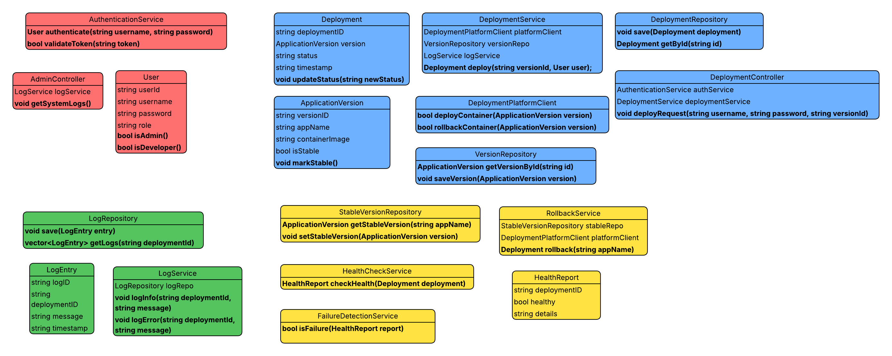

# Container Deployment and Rollback Automation System

This document provides a technical overview of the classes within the Container Deployment and Rollback Automation System. 

---

## 🛠 System Overview
The system is color-coded by functional module to ensure a clean separation of concerns:
* 🔴 **Red:** Authentication and Authorization
* 🔵 **Blue:** Deployment and Version Management
* 🟢 **Green:** Logging and Auditing
* 🟡 **Yellow:** Health Monitoring and Rollback Logic

---

## 🔐 Authentication Module (Red)
Manages user identity and controls access to administrative functions.

| Class | Responsibility |
| :--- | :--- |
| **AuthenticationService** | Core service for verifying credentials via `authenticate()` and checking session validity with `validateToken()`. |
| **User** | Data model representing a user, containing role-based logic to check if a user `isAdmin()` or `isDeveloper()`. |
| **AdminController** | An interface for administrators to perform high-level tasks, such as calling `getSystemLogs()`. |

---

## 🚀 Deployment Module (Blue)
Handles the lifecycle of application containers and versioning.

* **DeploymentController**: The primary API entry point. It receives `deployRequest()` and coordinates with authentication and deployment services.
* **DeploymentService**: The orchestrator for the deployment process, managing the workflow between the repository and the platform client.
* **DeploymentPlatformClient**: The low-level interface that interacts with the container environment to `deployContainer()` or `rollbackContainer()`.
* **Deployment**: An entity that tracks the state of a specific deployment, including its `status` and `timestamp`.
* **ApplicationVersion**: Represents a specific build or image, tracking the `containerImage` and whether it is currently marked as stable.

---

## 📝 Logging Module (Green)
Ensures all system actions are recorded for debugging and security audits.

* **LogService**: The logic layer used by other modules to `logInfo()` or `logError()` during operations.
* **LogRepository**: Handles the persistence of log data to the database.
* **LogEntry**: A data object representing an individual log record, including the specific `deploymentID` it relates to.

---

## 🔄 Rollback & Health Module (Yellow)
Automates the detection of failures and restoration of service.

* **RollbackService**: Manages the logic to revert an application to a previous state using the `rollback()` method.
* **HealthCheckService**: Executes a `checkHealth()` routine on active deployments to ensure the container is responding correctly.
* **FailureDetectionService**: A specialized logic class that evaluates a `HealthReport` to determine if the system should trigger an automated rollback.
* **StableVersionRepository**: A dedicated repository that tracks the "Last Known Good" version of an application to ensure safe recovery.

---

## ⚙️ How the System Operates
1.  **Request:** A developer initiates a deployment through the **DeploymentController**.
2.  **Verify:** The **AuthenticationService** ensures the user has the correct permissions.
3.  **Deploy:** The **DeploymentService** retrieves the image from the **VersionRepository** and instructs the **DeploymentPlatformClient** to run it.
4.  **Monitor:** Once live, the **HealthCheckService** generates a **HealthReport**.
5.  **Recover:** If the **FailureDetectionService** identifies a failure, the **RollbackService** automatically fetches the last stable version from the **StableVersionRepository** and redeploys it.