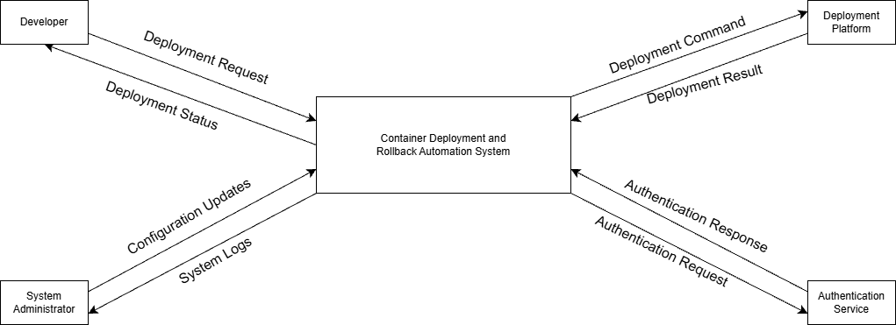
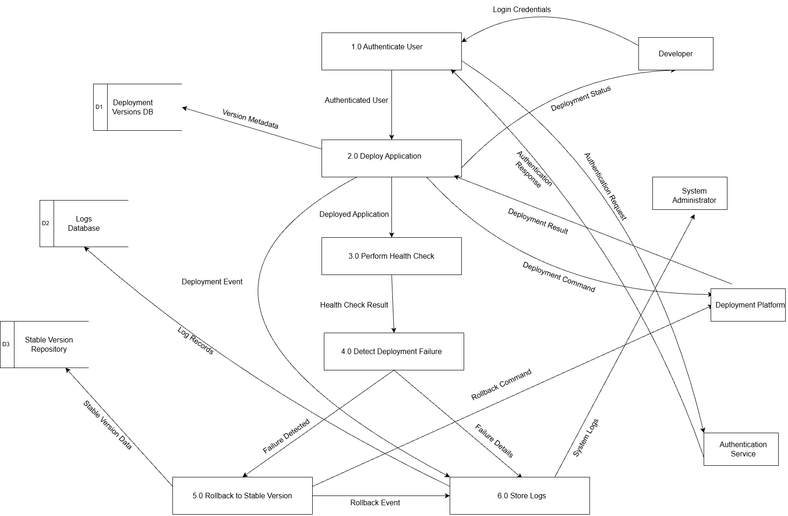

# Data Flow Diagrams (DFD)

This document presents the **Data Flow Diagrams (DFDs)** for the **Container Deployment and Rollback Automation System**.  
The diagrams illustrate how data moves through the system, the interactions with external entities, and the internal processing logic.

---

## Level 0 DFD (Context Diagram)

The **Level 0 DFD** represents the system as a single process and shows its interaction with external entities.
### Diagram

### External Entities
- **Developer** – Initiates deployment requests and receives deployment status.
- **System Administrator** – Provides configuration updates and receives system logs.
- **Deployment Platform** – Executes deployment and rollback commands.
- **Authentication Service** – Authenticates users and returns authentication responses.

### Major Data Flows
- Deployment Request / Deployment Status
- Authentication Request / Authentication Response
- Deployment Command / Deployment Result
- Configuration Updates
- System Logs

---

## Level 1 DFD (Detailed System Decomposition)

The **Level 1 DFD** expands the main system into detailed sub-processes, showing internal logic and data stores.
### Diagram

### Processes
1. **Authenticate User**  
   - Validates login credentials via the Authentication Service.
2. **Deploy Application**  
   - Deploys the selected application version using the Deployment Platform.
3. **Perform Health Check**  
   - Verifies the health of the deployed application.
4. **Detect Deployment Failure**  
   - Analyzes health check results to detect failures.
5. **Rollback to Stable Version**  
   - Reverts the system to a stable version in case of deployment failure.
6. **Store Logs**  
   - Stores system and deployment logs for monitoring and auditing.

### Data Stores
- **D1: Deployment Versions DB** – Stores metadata of application versions.
- **D2: Logs Database** – Stores system and deployment logs.
- **D3: Stable Version Repository** – Maintains stable application versions for rollback.

### Key Data Flows
- Login Credentials
- Deployment Command / Deployment Result
- Health Check Result
- Failure Details
- Rollback Command
- Log Records

---

## Summary

- **Level 0 DFD** provides a high-level system overview.
- **Level 1 DFD** explains internal processes, data stores, and control flow.
- Together, these diagrams clearly describe how the deployment and rollback automation system operates.
