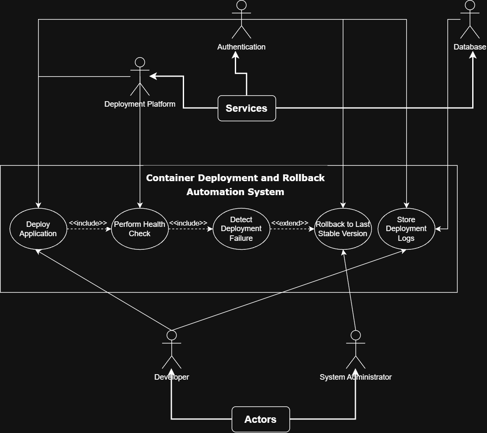

# Container Deployment and Rollback Automation System  
## UML Use Case Diagram

---

##  Project Overview

The **Container Deployment and Rollback Automation System** is designed to automate the deployment of containerized applications and ensure system reliability by rolling back to the last stable version whenever a deployment failure is detected.

This repository contains the **UML Use Case Diagram** for the system, which has been designed in alignment with the Software Requirements Specification (SRS) prepared for *Software Engineering Lab 1*.

---

##  UML Use Case Diagram

The following diagram represents the functional behavior of the system and the interactions between users, external services, and internal system processes:

---

##  Actors

The system interacts with the following actors:

### 1. Developer  
- Initiates application deployment  
- Monitors deployment outcomes  
- Triggers rollback operations if required  

### 2. System Administrator  
- Oversees system stability  
- Reviews deployment and rollback logs  
- Manages rollback operations  

### 3. External Systems (Modeled as Actors)

- **Deployment Platform**  
  Executes container deployments and runtime operations.

- **Authentication Service**  
  Verifies the identity and authorization of users.

- **Database**  
  Stores deployment history, logs, and version metadata.

---

##  Use Cases

The system provides the following core functionalities:

### 1. Deploy Application  
Deploys a containerized application using a specified image version.

### 2. Perform Health Check  
Checks the operational status of the deployed application.

### 3. Detect Deployment Failure  
Identifies whether a deployment has failed based on health check results.

### 4. Rollback to Last Stable Version  
Restores the previously stable application version when a failure is detected.

### 5. Store Deployment Logs  
Records all deployment and rollback activities for auditing and monitoring.

---

##  Use Case Relationships

The diagram uses standard UML relationships:

- **<<include>>**
  - `Deploy Application` includes `Perform Health Check`
  - `Perform Health Check` includes `Detect Deployment Failure`

- **<<extend>>**
  - `Detect Deployment Failure` extends `Rollback to Last Stable Version`  
    (Rollback is triggered only if a failure is detected)

These relationships ensure:
- Health checks always follow deployment  
- Failure detection is part of health monitoring  
- Rollback is conditionally executed  

---

##  Traceability with SRS

The UML diagram is directly traceable to the SRS functional requirements:

| SRS Requirement | UML Use Case |
|-----------------|--------------|
| FR-1 Deployment Automation | Deploy Application |
| FR-2 Version Tracking | Store Deployment Logs |
| FR-3 Health Check | Perform Health Check |
| FR-4 Failure Detection | Detect Deployment Failure |
| FR-5 Rollback Operation | Rollback to Last Stable Version |
| FR-6 Logging | Store Deployment Logs |

---

##  Security Consideration

User authentication is handled via an external **Authentication Service**, ensuring that only authorized users can initiate deployments or rollback operations, as required by **NFR-5 (Security)** in the SRS.

---

##  Summary

This UML use case diagram:
- Clearly defines system boundaries  
- Accurately models functional requirements  
- Uses correct <<include>> and <<extend>> relationships  
- Represents both internal behavior and external system interactions  
- Aligns with the provided SRS and academic UML standards  

It serves as a strong foundation for the design and implementation of the Container Deployment and Rollback Automation System.

---

